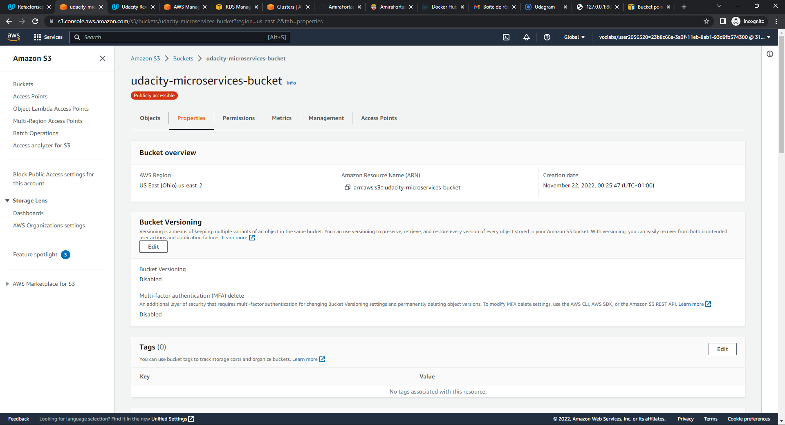
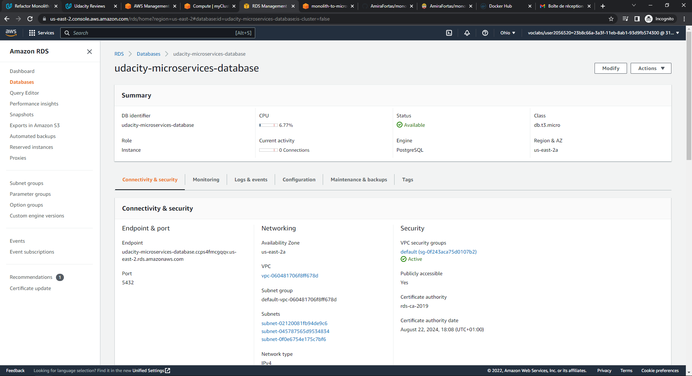

# Screenshots

## AWS S3
##### Amazon Simple Storage Service Screenshot
<figure>
    
    <figcaption>Amazon Simple Storage Service Screenshot</figcaption>
</figure>

## AWS RDS
##### Amazon Relational Database Service Screenshot
<figure>
    
    <figcaption>Amazon Relational Database Service Screenshot</figcaption>
</figure>

## Deployment Pipeline
##### DockerHub showing containers that you have pushed
<figure>
    
    <figcaption>DockerHub Before Pushing Images Screenshot</figcaption>
</figure>
<figure>
    
    <figcaption>DockerHub After Pushing Images Screenshot</figcaption>
</figure>

##### GitHub repository’s settings showing your Travis webhook (can be found in Settings - Webhook)
<figure>
    
    <figcaption>Travis CI Webhook</figcaption>
</figure>

##### Travis CI showing a successful build and deploy job
<figure>
    
    <figcaption>Travis CI Screenshot</figcaption>
</figure>

## Kubernetes
##### To verify Kubernetes pods are deployed properly
```bash
kubectl get pods
```
<figure>
    
    <figcaption>kubectl get pods Screenshot</figcaption>
</figure>

##### To verify Kubernetes services are properly set up
```bash
kubectl describe services
```
<figure>
    
    <figcaption>kubectl describe services 1 Screenshot</figcaption>
</figure>
<figure>
    
    <figcaption>kubectl describe services 2 Screenshot</figcaption>
</figure>

##### To verify that you have horizontal scaling set against CPU usage
```bash
kubectl describe hpa
```
<figure>
    
    <figcaption>kubectl describe hpa 1 Screenshot</figcaption>
</figure>
<figure>
    
    <figcaption>kubectl describe_hpa 2 Screenshot</figcaption>
</figure>

##### To verify that you have set up logging with a backend application
```bash
kubectl logs {pod_name}
```

<figure>
    
    <figcaption>kubectl logs backend feed Screenshot</figcaption>
</figure>
<figure>
    
    <figcaption>kubectl logs backend user Screenshot</figcaption>
</figure>
<figure>
    
    <figcaption>kubectl logs frontend Screenshot</figcaption>
</figure>
<figure>
    
    <figcaption>kubectl logs reverse proxy Screenshot</figcaption>
</figure>
